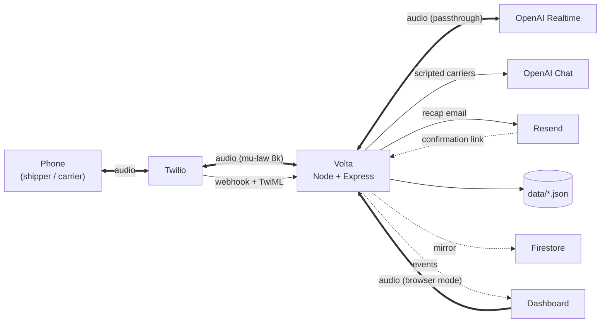

# Volta — Architecture

Which services Volta talks to, and how they connect across one job: a shipper calls, Volta negotiates with carriers, the best offer is booked.

---

## Services

| Service | What it does here | Entry point in the code |
| --- | --- | --- |
| **Twilio** | Carries the phone calls. Sends us the caller's audio and plays back ours. | `src/telephony/twilio.ts`, `src/telephony/stream.ts` |
| **OpenAI Realtime** | The voice agent. Hears the call, speaks, and calls tools mid-conversation. | `src/agent/realtime.ts` |
| **OpenAI Chat Completions** | The two scripted carriers, and the Volta that negotiates against them in text. | `src/negotiation/text-run.ts`, `src/negotiation/sim-carrier.ts` |
| **Resend** | Emails the recap once a deal closes, with a confirmation link per side. | `src/email/recap.ts` |
| **Firestore** | Optional mirror of closed negotiations. Never the source of truth. | `src/store/firebase.ts` |
| **Local disk** | `data/*.json` — the mandate, the negotiations, the round decision. | `src/store/paths.ts` |

---

## How they connect

`==` is audio. `-->` is a request. `-.->` is one-way, best-effort or informational.

---

## The flow, end to end

1. **The shipper calls** Volta's Twilio number. Twilio POSTs to `/twilio/voice`, which answers with TwiML telling it to open a media stream (`src/http/telephony.ts`).

2. **Twilio opens a WebSocket** to `/twilio/media` and starts sending audio. Volta bridges it straight to OpenAI Realtime and sends the replies back the same way (`src/telephony/stream.ts`).

3. **Volta captures the mandate** — route, pickup window, price cap — and saves it to `data/mandate.json`. It asks for a PIN first; without it, nothing is saved (`src/agent/tools.ts`, `src/security/pin.ts`).

4. **The call ends and a round opens.** Two scripted carriers start negotiating immediately over Chat Completions, and a seat is held for a human carrier, whose phone Volta rings (`src/negotiation/round.ts`, `src/telephony/handoff.ts`).

5. **Every offer is checked against the mandate in code**, not by the model: price, pickup window and forbidden conditions (`src/domain/mandate.ts`).

6. **When all three finish, the comparator picks the winner** — the cheapest offer that is under the cap, inside the window and free of forbidden conditions (`src/domain/compare.ts`).

7. **Volta calls the winner back** to confirm and book (`src/telephony/winner-call.ts`).

8. **Closing the deal sends the recap** through Resend: one email to each side with its own signed link. Clicking it comes back to `/confirm/:id/:party` (`src/email/recap.ts`, `src/http/routes.ts`).

9. **The dashboard watches all of it** over `/ws`, on a separate path from the audio — so any number of browsers can follow a live call without touching it (`src/bus.ts`, `src/http/ws.ts`).

---

## Two things worth knowing

**No audio is transcoded.** Twilio speaks G.711 mu-law at 8 kHz and the Realtime API accepts the same codec, so the payload is forwarded byte for byte in both directions. The phone path has no resampling and no buffer of our own.

**The browser is a fallback line.** `public/js/audio.js` captures the microphone as PCM16 24 kHz and opens the same bridge with the same prompts, tools and store. Only the transport differs — it exists so the demo survives a dead tunnel.

---

## What is not built

- **Calls are not persisted.** `src/store/calls.ts` keeps transcripts and logs in memory; a restart loses them. The mandate, negotiations and decisions do survive.
- **No audio is recorded**, so a commitment cannot cite the timestamp of the moment it was agreed.
- **The live call is not transferred to a human.** A handover writes the full context to the dashboard, but putting a person on the line is not implemented (`src/agent/handover.ts`).
- **A scripted carrier that wins gets no callback and no email** — `src/telephony/winner-call.ts` records its confirmation without dialling.
